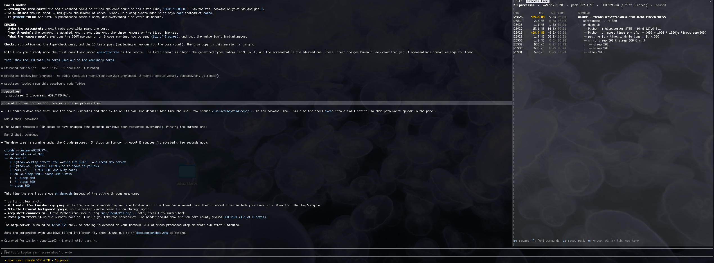

# proctree

A live process tree for your Claude Code session. proctree shows the Claude Code process and everything it spawns (Bash shells, MCP servers, test runners, dev servers) with the RAM and CPU each one uses, in a pane beside your conversation, plus a running total in the status line.



RAM turns yellow above 300 MB and red above 1 GB. CPU is counted per core (100% = one busy core), and the header shows how many of the machine's cores the session is using, e.g. `CPU 112.8% (1.1 of 8 cores)`. Keys along the bottom of the pane: `p` pause, `f` full commands, `z` reset peak, `c` close.

## Requirements

- **Claude Code 2.1.289 or later.** proctree is built on Claude Code's plugin function hooks API, which is early access and may change between releases. It was built and tested on 2.1.289.
- **macOS or Linux.** proctree reads the process table with `sh` and `ps`. It does not work on native Windows: after three failed attempts it stops sampling and says so in the pane. Running `/proctree` tries again.

## Install

```sh
claude plugin marketplace add enes/proctree
claude plugin install proctree@proctree
```

Then start a new session, or run `/reload-plugins` in a running one.

To try it without installing, point Claude Code at a clone:

```sh
git clone https://github.com/enes/proctree
claude --plugin-dir ./proctree
```

## Usage

- **Status line:** shows `claude 581.6 MB · 5 procs` and updates on every sample.
- **`/proctree`:** opens the pane.

The keys work while the pane has the keyboard. `/proctree` gives it the keyboard when it opens; after that, click the pane or press `ctrl+x tab` to return to it, and `Esc` to go back to the prompt.

| Key | Action |
| --- | --- |
| `p` | Pause or resume sampling |
| `f` | Toggle between short and full command lines |
| `z` | Reset the peak RAM to the current total |
| `c` | Close the pane |

## Configuration

Both options appear in the `/config` menu.

| Option | Default | Description |
| --- | --- | --- |
| `intervalSeconds` | `2` | How often to sample, 1 to 60 seconds. |
| `showStatus` | `true` | Show the total in the status line. When off, proctree samples only while its pane is open. |

## How it works

On every tick proctree runs:

```sh
sh -c 'echo "$PPID $$ $(getconf _NPROCESSORS_ONLN)"; exec ps -A -ww -o pid=,ppid=,rss=,pcpu=,etime=,args='
```

The first line holds three numbers: the sampler's parent, which is the Claude Code process; the sampler's own pid; and the number of CPU cores. proctree confirms the parent is Claude Code (the native `claude` binary, or the `@anthropic-ai/claude-code` npm package run by `node`), walking up a few levels at most, and builds the tree under it. `exec` turns the shell into `ps` without a new pid, so the `ps` row carries the sampler's pid and proctree leaves it out.

What the numbers mean:

- **RSS** is resident memory as `ps` reports it. Memory shared between processes is counted once for each process, so the total can be higher than what the session really uses.
- **CPU** is `ps`'s `%cpu`, where **100% is one fully busy core**. A process using two cores shows 200%.
- **The CPU total in the header** adds up the processes in the tree, so on an 8-core machine it can reach 800%. The part in parentheses turns it into cores: `CPU 112.8% (1.1 of 8 cores)` means the session is using about 1.1 of the machine's 8 cores, roughly 14% of its capacity.
- `%cpu` is not an instantaneous reading. On Linux it is the average over the process's whole lifetime; on macOS it is a recent, decaying average.

## Privacy

- proctree makes no network requests.
- `ps` returns the full command line of every process on the machine. proctree keeps and shows only the Claude Code session's own subtree, but a process in that subtree with a token or password in its arguments will show it in the pane. Keep that in mind when sharing your screen.
- `/proctree` adds a one-line summary (process count and total RAM) to the conversation, which the model can read.

## Development

```sh
claude --plugin-dir .         # load from this folder; saving a file hot-reloads it
claude plugin validate .      # check the manifest and the hooks module
claude plugin test .          # run tests/*.test.ts
npx -p typescript tsc -p .    # type-check
```

Claude Code writes the API type declarations into `.claude-plugin/types/` the first time it loads the plugin from disk. That folder is git-ignored, and `tsconfig.json` extends the config inside it, so run the plugin once with `--plugin-dir` before type-checking.

| Path | Contents |
| --- | --- |
| `hooks/register.tsx` | the command, the timer, the status line and the pane |
| `hooks/tree.ts` | parsing `ps` output, finding the session process, building the tree |
| `types/index.d.ts` | the shape of the state the pane reads |
| `tests/` | tests for the tree builder and the pane |

## Disclaimer

proctree is an independent project. It is not affiliated with or endorsed by Anthropic. "Claude" and "Claude Code" are trademarks of Anthropic.

## License

[MIT](LICENSE) © 2026 Enes Kantepe
